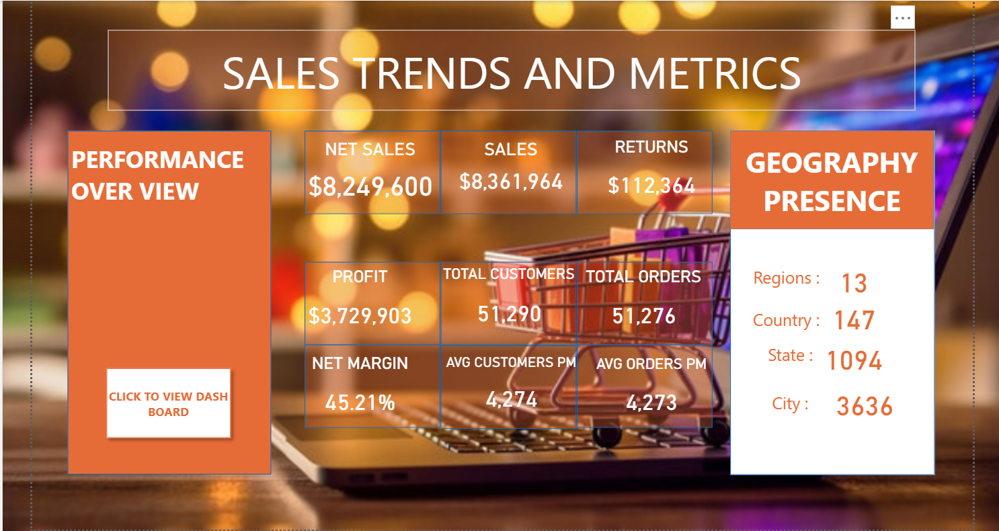
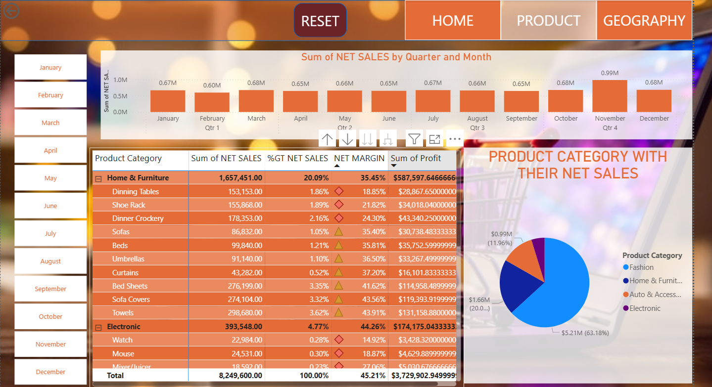
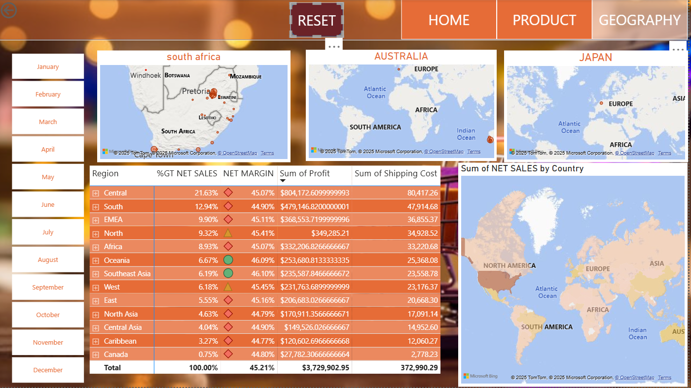

# 📊 Sales Trend & Metrics Dashboard – Power BI

An interactive Power BI dashboard that visualizes monthly sales trends, category performance, and key metrics. This project uses dynamic tooltips, buttons, and filters to enhance the exploration experience and uncover data-driven insights.

##  Key Features

-  Monthly Sales Trend Visualization
-  Category-Wise Performance Breakdown
-  KPI Cards (Net Sales, Units Sold, Net Margin)
-  Dynamic Tooltips for added context
-  Interactive Filters and Category Buttons

## Insights Answered

- What is the **category-wise sales performance** for the year?
- Which month had the highest and lowest net sales by category?
- How do different categories perform across months (e.g., Home Furniture peaks in November)?

## Tools Used

- **Power BI** – for dashboard creation
- **Excel** – for data preparation
- **DAX** – for calculated measures
- **Tooltips** – to add interactivity and explain data clearly

##  Dashboard Previews

###  Sales Overview

### 📈 product

### 📅 geography

## 🙋‍♀️ About Me

I'm **Bezawit**, an aspiring analyst passionate about transforming raw data into valuable insights through storytelling, visualization, and practical business questions.  
🔗 Connect with me on [LinkedIn](https://www.linkedin.com/in/bezawit-assefa-4964592aa)

> 💡 *Feel free to star ⭐ the repo if you found this project helpful or inspiring!*

"# East-side-sales-and-trend" 
